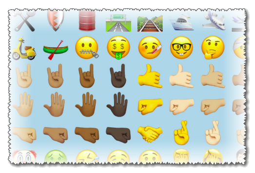

<h1>whatsapp-emoji - &nbsp; &nbsp; </h1>

emoji, png, svg ripped shamelessly from various versions of whatsapp APKs

<h1><a href="https://github.com/eladkarako/whatsapp-emoji/archive/master.zip">Download (6.20MB)</a></h1>

<h1><a href="https://eladkarako.github.io/whatsapp-emoji/index.html">Visit Preview Page</a></h1>

Currently containing <strong>2418</strong> emoji (<strong>all the new ones!</strong>) and <strong>258</strong> SVG emoji files.

Update yourself?

Download latest APK from <a href="https://www.apkmirror.com/apk/whatsapp-inc/">apkmirror.com/apk/whatsapp-inc</a>,
extract it using 7zip. The Emoji files (PNG) are at <code>/res/drawable-nodpi-v4/</code>, the emoji files (SVG) (used for writing on pictures) are at <code>/assets/graphics/</code>.

Some additional graphic-files (<strong>non-emoji</strong>) of the app itself, are placed in <code>/res/drawable-hdpi-v4/</code>, <code>/res/drawable-xhdpi-v4/</code>, <code>/res/drawable-xxhdpi-v4</code> and <code>/res/drawable-xxxhdpi-v4/</code>.

